# Relay

A local-first collaborative workspace — workspaces, projects, issues and
CRDT-backed documents, with role-based access control, live updates over
WebSockets, and a board that keeps working with the network switched off.

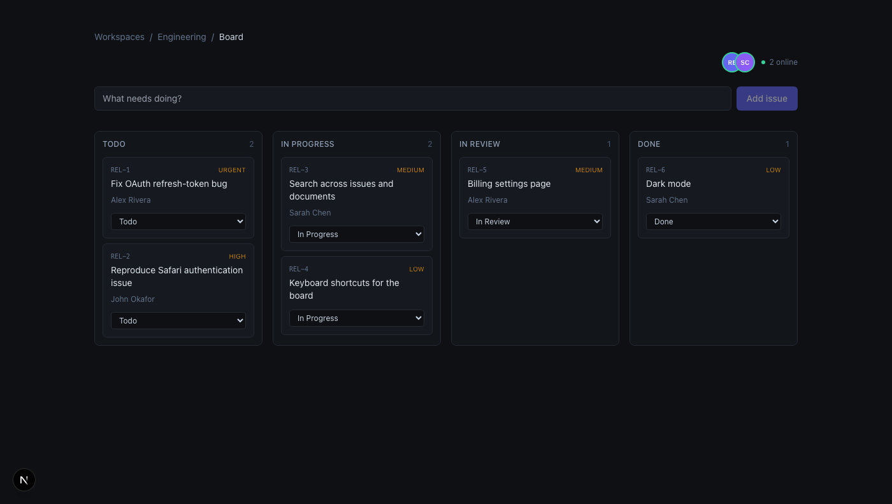

Everything below is running code. The screenshots are captured from the app by
a script, not mocked up.

---

## Quick start

You need [Bun](https://bun.sh) 1.4+. **No Docker, no Postgres install, no admin
rights** — the dev database runs from Postgres binaries fetched through npm.

### 1. Install and configure

```bash
bun install
cp .env.example .env
```

### 2. Start the database and load demo data

```bash
bun run db:start     # provisions + starts Postgres on :5433
bun run db:migrate   # applies the migration files
bun run db:seed      # 1 account, 2 projects, 10 issues
```

### 3. Run the three services

Each in its own terminal:

```bash
bun run dev:api        # REST API          → http://localhost:4000
bun run dev:realtime   # WebSocket gateway → ws://localhost:4001/ws
bun run dev:web        # Next.js client    → http://localhost:3000
bun run dev:worker     # Background jobs   (optional; needed for @mentions)
```

### 4. Sign in

Open <http://localhost:3000>.

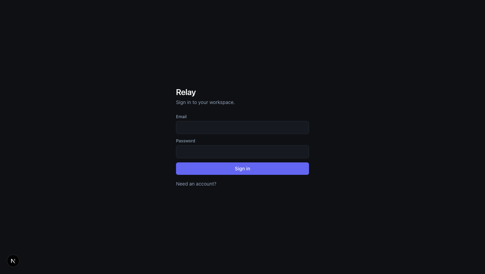

| Email             | Password              | Role  |
| ----------------- | --------------------- | ----- |
| `rohit@relay.dev` | `relay-demo-password` | OWNER |

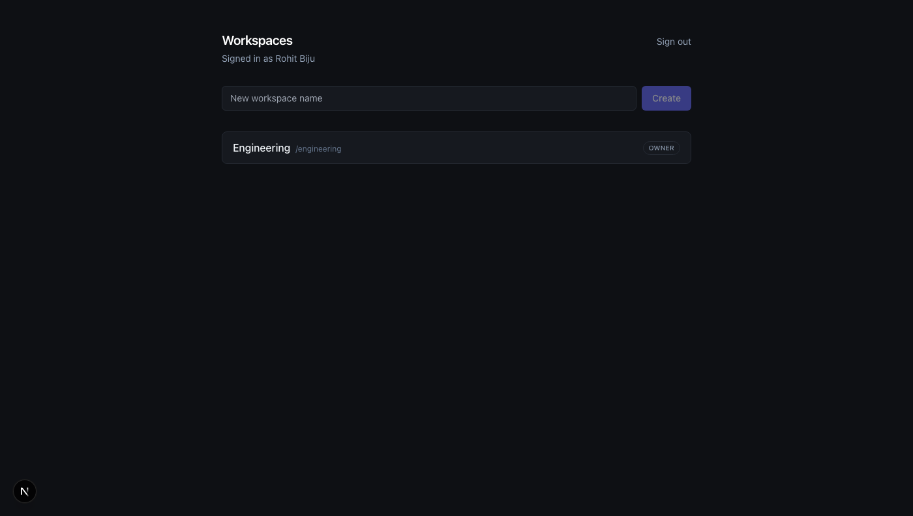

Click **Engineering** for the workspace, then a project for its board.

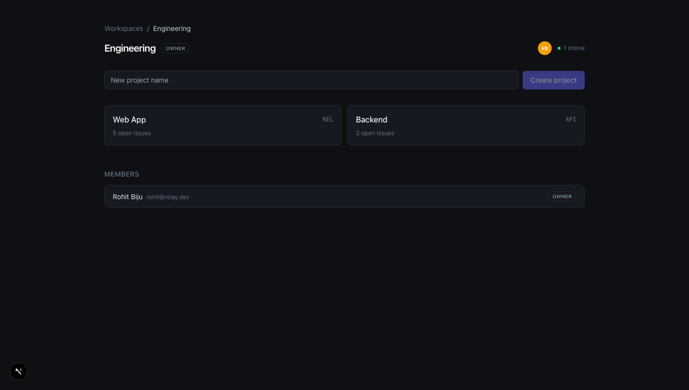


---

## See the interesting parts

### Live updates

Open the board in two windows. Create an issue in one and it appears in the
other with no reload — the WebSocket event triggers a reconcile directly, so
propagation is immediate rather than waiting on a poll.

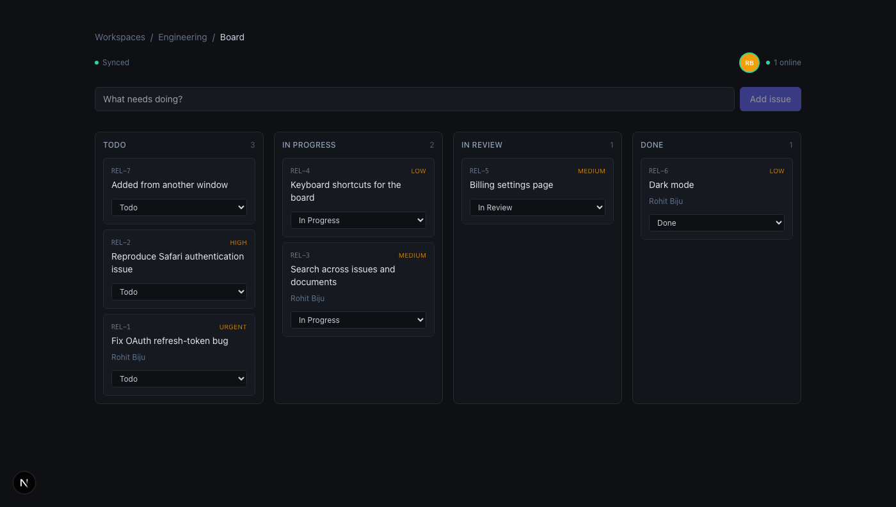

The presence bar counts distinct people, not tabs, so two windows signed in as
the same account correctly read `1 online`.

### Issues, comments and mentions

Click a card to open the issue: status, priority and assignee are editable
inline, and the title edits in place.

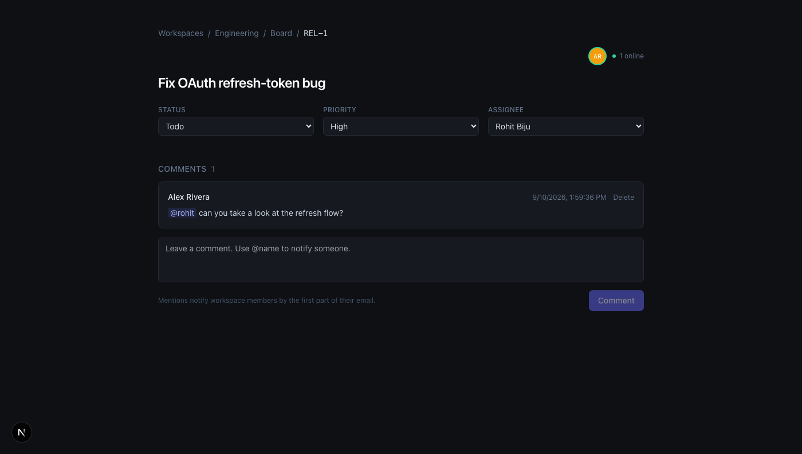

`@handle` in a comment resolves against workspace members and produces a
notification, delivered by the background worker rather than inline.

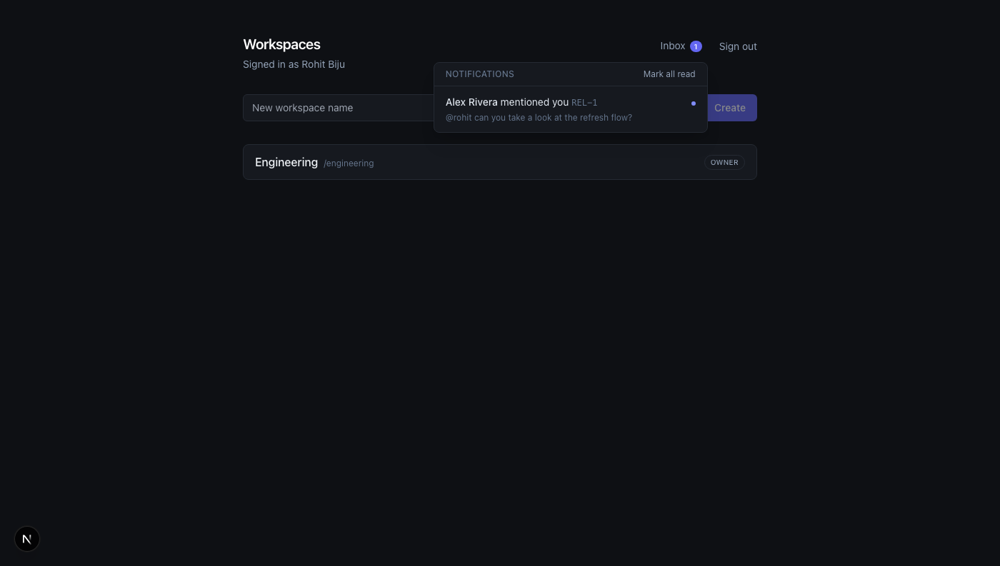

### Collaborative documents

Create a document from the workspace page and open it in two windows. Both
edit the same paragraph at once, and **both edits survive** — this is a Yjs
CRDT, so the server never picks a winner.

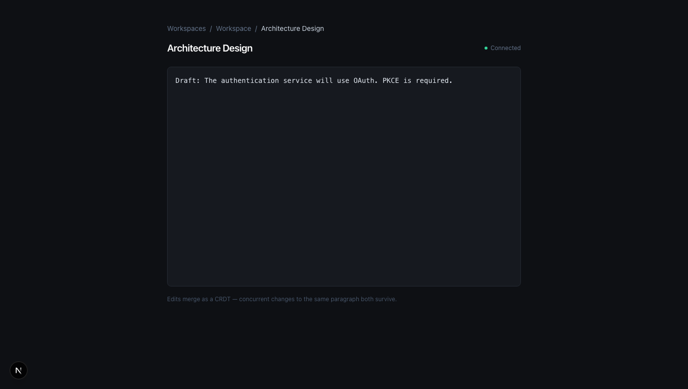

Issue fields merge under last-write-wins, which is fine for a status but
catastrophic for prose: two people typing in the same sentence would lose one
of the changes. Documents are the one place that genuinely needs a CRDT, which
is why they are the only place one is used.

### Working offline

On the board, cut the network (DevTools → Network → Offline, or turn off
Wi-Fi). The board keeps working — it renders from IndexedDB rather than
fetching.

Create issues with no connection. They appear immediately, outlined in amber
and marked **Unsynced**, and the header counts what is waiting.

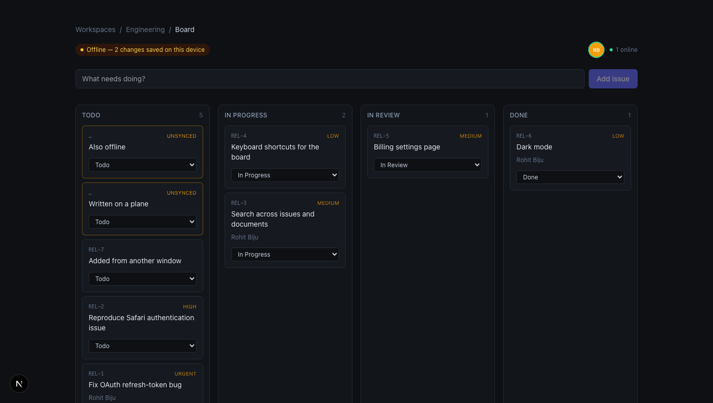

Reconnect and the queue drains by itself. The placeholder keys become real
`REL-8` / `REL-9` and the amber outlines clear.

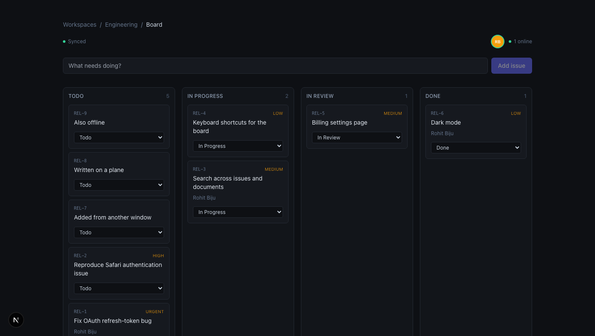

Reload the page while still offline and the board comes back — a service worker
serves the app shell from cache, and the issue store and mutation queue are read
from IndexedDB.

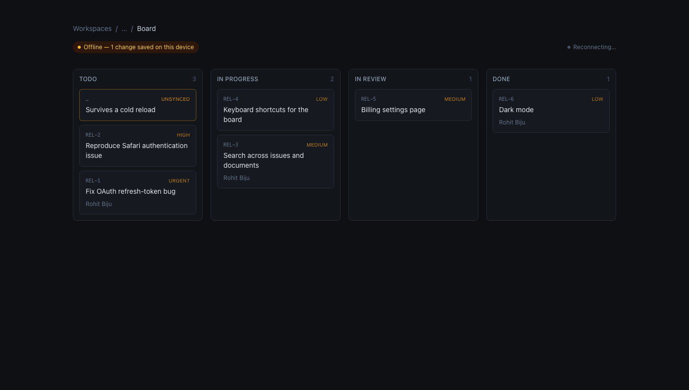

**Scope, honestly:** the board is the offline-capable route. Other pages still
fetch and will show the offline fallback if visited cold with no connection.
The service worker is network-first for navigations and cache-first for
fingerprinted assets; API and WebSocket traffic is never cached, because those
responses depend on who is asking.

### Roles and permissions

The seed creates one account, so there is nothing to see in the role model out
of the box. To exercise it:

```bash
bun run db:seed --team
```

That adds an admin, a member and a guest (all `@relay.dev`, same password).
Signing in as the guest shows the same board with the add-issue field and every
status dropdown gone — and the API returns `403` even if you send the request by
hand with `curl`.

The rules themselves are covered by
[`authorization.test.ts`](tests/authorization.test.ts) regardless of what is
seeded.

---

## Commands

| Command                 | What it does                                  |
| ----------------------- | --------------------------------------------- |
| `bun run db:start`      | Provision and start the local Postgres        |
| `bun run db:stop`       | Stop it, keeping data                         |
| `bun run db:reset`      | Destroy the data directory and re-provision   |
| `bun run db:migrate`    | Apply the migration files                     |
| `bun run db:push`       | Diff the schema straight on (fast iteration)  |
| `bun run db:seed`       | Load demo data (one account)                  |
| `bun run db:seed --team`| Add an admin, member and guest for role demos |
| `bun run grant:owner`   | Make an account OWNER of every workspace      |
| `bun run dev:api`       | REST API on :4000                             |
| `bun run dev:realtime`  | WebSocket gateway on :4001                    |
| `bun run dev:web`       | Next.js client on :3000                       |
| `bun run dev:worker`    | Background job worker                         |
| `bun test`              | Full suite against a real Postgres            |
| `bun run typecheck`     | Typecheck every package                       |
| `bun run lint`          | Biome lint + format check                     |
| `bun run lint:fix`      | Apply safe lint and format fixes              |

Bootstrap yourself into a fresh database:

```bash
bun run grant:owner you@example.com "Your Name" your-password
```

If you *do* have Docker, `docker compose up -d` starts the same Postgres on the
same port; skip `db:start` in that case.

---

## Architecture

```
        ┌──────────────┐
        │   Next.js    │  React 19 · TanStack Query
        │    :3000     │  presence · offline board
        └──┬────────┬──┘
           │  reads/writes go to IndexedDB first
        ┌──▼───────────┐
        │  sync engine │  durable mutation queue
        └──┬────────┬──┘
   REST +  │        │  WebSocket
   cookie  │        │  (same cookie)
        ┌──▼───┐ ┌──▼──────────┐
        │ API  │ │  Realtime   │
        │:4000 │ │  gateway    │
        │Fastify│ │   :4001    │
        └──┬───┘ └──┬──────────┘
           │        │  LISTEN
     write │        │  relay_events
           └───┬────┘
        ┌──────▼───────┐
        │  PostgreSQL  │  :5433
        │              │  NOTIFY on commit
        └──────────────┘
```

```
apps/
  api/          Fastify: routes, guards, mutations
  realtime/     Bun WebSocket gateway: fan-out, presence, document rooms
  worker/       Background job runner and handlers
  web/          Next.js client
packages/
  shared/       Permission matrix, domain enums, wire contracts
  database/     Drizzle schema, migrations, event bus, CRDT persistence
  auth/         Argon2 hashing, sessions
  sync/         Offline store, mutation queue, reconciliation
scripts/        Dev database lifecycle, seeding, admin bootstrap
tests/          Integration tests against real Postgres
docs/           Screenshots
```

`packages/shared` is imported by all three apps, so changing an event shape or a
request contract is a compile error everywhere rather than a runtime surprise.

---

## Engineering notes

The product surface is deliberately ordinary. These are the parts that weren't.

### Non-members get 404, not 403

The obvious rejection for someone else's workspace is `403 Forbidden`. That
answer confirms the workspace exists, turning the endpoint into an oracle:
iterate over ids and the 403/404 split maps out the tenant space.

[`requireMembership`](apps/api/src/plugins/authz.ts) returns **404** when there
is no membership row, and 403 only when a member lacks a specific permission —
at which point they already know the workspace exists.

### Authorization is a matrix, not scattered conditionals

Every check resolves to `can(role, permission)` against a table in
[`rbac.ts`](packages/shared/src/rbac.ts). Roles are built by extension, and a
test asserts they stay cumulative, so no role can ever do something its senior
cannot. Rules needing more than the actor's role live beside their data: an
admin cannot promote to owner, nobody can change their own role, and the last
owner cannot be demoted, removed, or leave.

The gateway and the API share one
[`findMembership`](packages/database/src/queries.ts) — two copies of an
authorization query is how they drift apart.

### Realtime runs on Postgres NOTIFY, not Redis

The plan called for Redis pub/sub. Postgres does it here, for one principled
reason and one practical one.

**`NOTIFY` is transactional.** A notification emitted inside a transaction is
delivered only if that transaction commits. Publishing to Redis from inside a
database transaction has no such guarantee — the message can go out and then the
write can roll back, leaving every client refetching stale data. Getting that
right against Redis needs an outbox table and a relay process; here it is free.
There is [a test](tests/realtime.test.ts) asserting a rejected write emits no
event.

**Practically**, it is one fewer service, and this machine has no Redis.

The cost is real: notifications are fire-and-forget with no persistence, the
payload caps at 8000 bytes, and each listener holds an idle connection. At high
fan-out Redis is the right replacement — but only
[two functions](packages/database/src/events.ts) would change.

### Events carry ids, never row contents

A payload would have to be filtered per recipient — an event about an issue must
not leak fields to someone whose role cannot read them — and would go stale
between publish and delivery. Sending an id and letting the client refetch
through the normal authorized endpoint keeps **one** authorization path instead
of two, and makes a missed event during reconnect self-healing.

### Presence is in memory, gossiped between instances

Presence changes on every navigation and heartbeat, and none of it is worth
durability. Writing it to Postgres would turn a read-mostly database into a
write-heavy one for data that is meaningless in thirty seconds.

So it lives in memory per gateway instance, and instances exchange deltas over
the same NOTIFY channel. A gateway that dies would leave ghosts, so every entry
carries a `lastSeenAt` refreshed by the client heartbeat and
[a sweeper](apps/realtime/src/presence.ts) drops stale ones. Redis with per-key
TTLs would remove the sweep.

### The gateway is a separate process

Long-lived sockets and short request/response traffic scale differently — one is
bounded by memory and file descriptors, the other by CPU — and separating them
means deploying the API does not drop every open connection.

### Issue numbering is a row lock, not a read-then-write

Human-readable keys (`REL-104`) need a per-project counter. Reading the maximum
and adding one races. Instead each create runs
`UPDATE projects SET issue_counter = issue_counter + 1 ... RETURNING` inside the
insert transaction, taking a row-level lock. A test fires 25 simultaneous
creates and asserts the results are exactly `1..25` — contiguous, proving
nothing collided *and* nothing was skipped.

### The local store is the source of truth for the UI

The board reads from IndexedDB and writes to it, then reconciles. Nothing in the
render path awaits the network, which is what makes it work offline rather than
merely degrade gracefully.

The inversion that makes this safe: **the local store is authoritative for the
UI, the server is authoritative for the world.** Reconciliation overwrites local
rows with server state — except rows with unflushed mutations, which keep their
local values, because discarding them would silently destroy work the user can
see on screen. There is
[a test](tests/sync.test.ts) for exactly that.

The engine talks to a
[`StorageAdapter`](packages/sync/src/storage.ts) and a `SyncTransport` rather
than to IndexedDB and `fetch`, so the interesting logic — queue ordering, retry
policy, convergence — is unit-testable with no browser and no server.

### Offline writes need exactly-once delivery, not at-least-once

A queued mutation that is replayed after an ambiguous failure — request sent,
response lost — must not apply twice. "Create issue" retried naively produces
two issues.

Two mechanisms together give exactly-once:

**The client names the row.** An offline create generates its own uuid, so the
issue can be rendered, referenced and edited before the server has heard of it.
A replayed insert then collides on the primary key instead of producing a second
row.

**The server keeps an idempotency ledger.** Each mutation carries a stable key;
[`withIdempotency`](apps/api/src/plugins/idempotency.ts) claims it with an
atomic `INSERT ... ON CONFLICT DO NOTHING`, and a replay returns the stored
response instead of re-running the handler. Reusing a key with a *different*
body is a 409 rather than a silent replay, because that is a client bug worth
surfacing. A failed attempt releases its key, so a transient error does not
poison it permanently.

### A poison message must not wedge the queue

The queue flushes in order and stops at the first transient failure — a create
that has not landed must not be overtaken by an edit against it.

But a 4xx means the server understood and refused, and retrying forever would
block every later mutation behind it. Those are dropped and the local change
rolled back. 408 and 429 are explicitly treated as transient, since they mean
"later", not "no".

### Documents are stored as CRDT bytes, not text

`documents` holds a compacted Yjs snapshot; `document_updates` is an
append-only log of updates recorded after it. Writing a full snapshot per
keystroke would rewrite the whole document for a one-character change, so
appending keeps a write proportional to the edit. Compaction folds the log back
in past a threshold.

It needs no transaction. Compaction is bounded by the highest sequence number
it read, so an edit arriving mid-compaction survives; and if the process dies
between writing the snapshot and deleting the log, the log is simply reapplied
on load. Yjs updates are idempotent, so the result is identical.

The content column is `bytea` rather than text because the merge rules live in
the data structure. Storing plain text would force the server to choose a
winner, which is the thing CRDTs exist to avoid.

### The gateway serialises messages per connection

Handlers are async, and the runtime does not wait for one to finish before
delivering the next. A client sending `subscribe` immediately followed by
`doc.open` raced: the second ran while the first was still awaiting its
membership lookup, saw no workspace on the socket, and was rejected — leaving
the editor stuck on "Connecting…". Messages are now chained per connection so
observable order matches wire order.

### "Online" means reachable, not connected

`navigator.onLine` is false only when there is no network interface at all.
Behind a captive portal, or against a server that is down, it happily reports
true — which showed up in testing as the UI claiming "Synced" while every
request was failing.

The indicator now requires both signals: an interface *and* a sync attempt that
actually succeeded. Retries keep running whenever an interface exists, because
a failure is exactly the state that needs re-testing and a recovering server
emits no `online` event to wake anything up.

### The job queue is Postgres, for the same reason the event bus is

`SKIP LOCKED` gives multi-worker claiming without a broker: each worker's
transaction locks the rows it selects and skips rows another worker already
holds, so batches are disjoint with no coordinator.

The reason to prefer it here is the same one that chose `NOTIFY` over Redis --
**enqueue can join the transaction that caused it**. Posting a comment inserts
the row and schedules its notification job atomically, so there is no window
where the comment exists and the job was lost, and no job for a comment that
rolled back. An external broker needs an outbox table to match that, which is
what this already is.

Delivery is at-least-once: a worker that stalls past the visibility timeout has
its job reclaimed and re-run, so handlers must be idempotent. The mention
handler relies on a unique index over `(user_id, kind, entity_id)` to make a
redelivery a no-op rather than a second notification — there is
[a test](tests/queue.test.ts) that runs it three times and asserts one row.

What Postgres does not give: this polls rather than blocking on a socket, and
throughput is bounded by the database. Those are the numbers to watch before
reaching for a broker.

### Development runs migrations, not `push`

`drizzle-kit push` diffs the schema straight onto the database, which is
convenient while iterating and dangerous as a default: it means development
executes SQL that CI and the tests never run.

That divergence hid a real bug. A unique index existed in the migration and in
`schema.ts`, the tests applied the migration and passed, and a pushed dev
database was missing it — so the mention handler failed on `ON CONFLICT` in
dev while every test stayed green. `bun run db:migrate` is now the documented
path, so all three environments execute the same statements.

### Sessions are opaque, not JWTs

Session lookup costs one indexed read per request. In exchange, signing out
actually invalidates the session. Only the SHA-256 of the token is stored, so a
database leak doesn't hand out usable cookies — and the same session logic
authenticates the WebSocket upgrade.

Plain SHA-256 rather than Argon2 is deliberate: the token is already 256 bits of
CSPRNG output, so there is nothing to brute-force. Passwords, which *are*
low-entropy, use Argon2id.

### Login doesn't leak which emails are registered

A failed login verifies a throwaway Argon2 digest when no user matches, so the
response takes the same time either way and both failures return an identical
body.

---

## Testing

**154 tests** against a real Postgres rather than mocks. The behaviour under test
— unique constraints, cascades, row locks, transactional `NOTIFY` — is behaviour
the database provides, so a fake would only prove the fake works.

```bash
bun test
```

| Suite                   | Covers                                                          |
| ----------------------- | --------------------------------------------------------------- |
| `rbac.test.ts`          | Permission matrix, role cumulativity, rank ordering              |
| `auth.test.ts`          | Registration, login, session revocation, enumeration resistance  |
| `authorization.test.ts` | Cross-tenant access, role boundaries, escalation, last owner     |
| `issues.test.ts`        | Numbering under concurrency, assignment, cascades                |
| `realtime.test.ts`      | Socket auth, fan-out, cross-workspace isolation, presence        |
| `sync.test.ts`          | Offline queue, retry, poison messages, convergence               |
| `documents.test.ts`     | CRDT convergence, compaction, persistence round-trips            |
| `text.test.ts`          | Textarea-to-CRDT edit extraction, 500 randomised round-trips     |
| `queue.test.ts`         | `SKIP LOCKED` claiming, backoff, dead-letter, mention delivery   |
| `mentions.test.ts`      | Mention parsing, ambiguity, emails-in-prose false positives      |
| `idempotency.test.ts`   | Exactly-once mutations, key misuse, client-generated ids         |

The ones worth reading are adversarial: pasting another tenant's project id into
a URL you *do* have access to, an admin trying to promote itself past its
ceiling, a socket subscribing to a workspace it doesn't belong to, and the
25-way concurrent create.

---

## Status

**Done**

- Multi-tenant workspaces, four-role RBAC, audit trail
- Session auth (Argon2id, opaque server-side sessions)
- Projects and issues with per-project keys, comments
- Realtime updates and presence over WebSockets
- Offline-first board: IndexedDB store, durable mutation queue, exactly-once sync
- Service worker so the app shell loads with no network
- CRDT documents (Yjs) with live cursors, stored as an append-only update log
- Background job queue on Postgres `SKIP LOCKED`, with `@mention` notifications
- Issue detail pages, comment threads, and a notification inbox
- Next.js client with optimistic updates
- 154 tests, CI, linting, typechecking

**Next**

- Member management UI, search, file uploads
- Rate limiting on auth and mutation endpoints
- Load testing and OpenTelemetry

See [docs/ROADMAP.md](docs/ROADMAP.md) for the full plan, including an honest
list of what is thin in what already exists.

Collaborative text is the one remaining piece that genuinely needs CRDTs. Issue
fields converge fine under last-write-wins per field — two people editing
different fields of the same issue both keep their change — but concurrent edits
to the *same* paragraph do not, which is what Yjs is for.

---

## Notes on the local toolchain

The dev database uses
[`embedded-postgres`](https://www.npmjs.com/package/embedded-postgres), which
ships real Postgres binaries through npm, so the repo runs with no container
runtime and no admin rights. Two wrinkles are handled in `scripts/`:

- The npm tarball loses the shared-library version symlinks the binaries link
  against, so `initdb` fails with a dyld error.
  [`fix-pg-dylibs.ts`](scripts/fix-pg-dylibs.ts) recreates them from
  `postinstall`.
- The package ships only `initdb`, `pg_ctl` and `postgres` — no `createdb` — and
  its JS wrapper spawns Postgres as a direct child, so the server dies with the
  script. [`dev-db.ts`](scripts/dev-db.ts) drives `pg_ctl` directly for a
  properly detached server and creates the database over the wire.

CI uses a plain Postgres service container instead, since it already has one.
